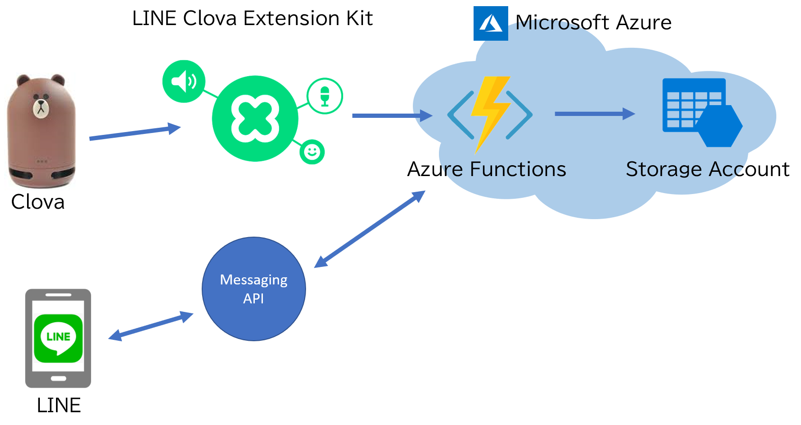

# イマドコ
イマドコは、大切な家族が今どこにいるか、音声で位置情報を教えてくれる LINE Clova スキルです。    
位置情報や伝言の登録は、スマホの LINE bot から行います。

機能説明は[コチラのページ](https://mangaclova.github.io/LINEDoko/)を参照してください

[https://mangaclova.github.io/LINEDoko/](https://mangaclova.github.io/LINEDoko/)

この README では、技術的な話だけを書きます。

# アーキテクチャ図



# 使用サービス

項目|値
----|----
使用言語|C#
開発環境|Visual Studio 2017
クラウド|Microsoft Azure Functions, Azure Table Storage

## LINE Clova スキルと bot 開発

* *Skill サーバサイド(実行環境)：<a href="https://azure.microsoft.com/ja-jp/services/functions/" title="Azure Functions" target="_blank">Microsoft
    Azure Functions (v2)</a>
* Skill サーバサイド(タイムスタンプの保存)：<a href="https://docs.microsoft.com/ja-jp/azure/storage/common/storage-introduction"
    title="Azure Storage Account" target="_blank">Microsoft Azure ストレージアカウント</a>
* LINE bot：<a href="https://developers.line.me/ja/services/messaging-api/" title="LINE Messaging API" target="_blank">LINE
    Messaging API</a>
* Skill の対話モデル作成：<a href="https://clova-developers.line.me/guide/" title="Clova Extensions Kit"
    target="_blank">Clova Extensions Kit</a>
* Clova Extension Kit を C# で使うための SDK：<a href="https://github.com/kenakamu/clova-cek-sdk-csharp" title="Clova CEK SDK C#"
    target="_blank">Clova CEK SDK C#</a>
* LINE Messaging API を C# で使うための SDK：<a href="https://github.com/pierre3/LineMessagingApi" title="LINE Messaging API for C#"
    target="_blank">LINE Messaging API for C#</a>

## Web サイト

* 写真素材：<a href="https://www.pakutaso.com/" title="フリー写真素材ぱくたそ" target="_blank">フリー写真素材ぱくたそ</a>
* Webページホスト：
    <a href="https://pages.github.com/" title="GitHub Pages" target="_blank">GitHub Pages</a>
* Webページフレームワーク：
    <a href="https://getbootstrap.com/" title="Bootstrap" target="_blank">Bootstrap (v4)</a>
* Twitter とか check box とかの汎用アイコンフォント集：
    <a href="https://fontawesome.com/" title="Font Awesome" target="_blank">Font Awesome</a>

## CI/CD

* 自動ビルドと自動デプロイ：<a href="https://azure.microsoft.com/ja-jp/services/devops/" title="Azure DevOps" target="_blank">Azure DevOps</a>
* チームのタスク管理：<a href="https://github.com/MangaClova/LINEDoko/projects/1" title="GitHub Projects" target="_blank">GitHub
    Projects</a>

# Azure DevOps

ソース管理には GitHub を使用して自動ビルド及び自動デプロイは Azure DevOps を使用しています。
YAML によるビルドパイプラインの定義（下記参照）や、今回は使用していませんがリリースプロセスのワークフローの定義など様々な機能が利用できます。

[YAML で定義したビルドパイプライン](https://github.com/MangaClova/LINEDoko/blob/master/azure-pipelines.yml)

今回は GitHub 上の Release ブランチに変更があったタイミングで自動ビルドとデプロイが実行されるように構成して使用しています。

リリース管理は Release ブランチのビルドが成功したら、そのビルド成果物を Microsoft Azure にデプロイしています。


# 詳細解説

## CEK / Messaging API

今回は Clova 側は単純に起動時に情報を読み取って返すだけなので、特に CEK でインテントを作ったりはしていません。
LINE Messaging API と Clova の Extension を同じプロバイダーに所属させるとユーザーごとにふられる ID が同じになるという点が今回のアプリでのポイントになります。

これで、LINE と Clova の連携をしています。

ボットにありがちな、ユーザーがなんと話しかけていいかわからない問題に関してはリッチメニューを使用して、このボットでやるために必要な操作を簡単に選択できるようにしています。


このようなエンドユーザーが簡単に使えるようになる工夫が Messaging API には数多く提供されている点が他のメッセージングプラットフォームと比べて優れていると感じました。

## Azure Functions

CEK と Messaging API の Webhook の実行環境として Azure Functions を使用しています。
Azure Functions の対応言語はプレビューのものも含めると C#, Java, JavaScript, Python がありますが、今回は C# で開発しています。開発環境は、Visual Studio Code / Visual Studio 2017 / 任意のテキストエディター + CLI ツールの組み合わせが可能です。今回の開発は Visual Studio Code と Visual Studio 2017 を、その時の状況によって使い分けました。

腰を据えてやるときは Visual Studio 2017 を起動して行い、隙間時間などで開発する場合は Visual Studio Code で開発を行いました。

### 腰を据えて開発するとき


### ライトに開発するとき


どちらの開発環境でも、コード補間が効いてビルド出来てデバッグ実行してデバッガをアタッチしてデバッグすることが出来ます。また、Microsoft Azure 上にデプロイを行うことが出来ます。

### Azure Functions の特徴

Azure Functions は関数の起動・関数の入力・関数の出力機能を使うことで関数の中から、関数の処理を起動するための監視や、関数の処理で必要な外部データの取得コードや、関数の処理結果を外部のデータストアに保存するための処理が非常にシンプルに書けます。

今回は Microsoft Azure の Storage Account という AWS でいう S3 みたいな機能を持っているサービスを使用しています。そして、そこにユーザーごとの設定などを保存しています。関数内でそれらのデータを使用する場合には、通常であれば、ストレージに対して認証情報を渡して接続を確立して対象ユーザーの情報を取得するためのストリームや各種 API のクラスを作成して操作するという流れになります。

Azure Functions の入力は、この処理を関数の外側でやるように設定して関数内では既に各種設定や下準備がされたクラスを引数として受け取って処理するだけで良くなります。

```cs
public static class MessagingApiFunctions
{
    [FunctionName("MessagingAPI")]
    public static async Task<HttpResponseMessage> Run(
        [HttpTrigger(AuthorizationLevel.Function, "post", Route = null)]HttpRequestMessage req, // Http の POST メッセージで起動するように指定
        ExecutionContext context,
        [Table("LocationLogs")] CloudTable locationLogs, // Storage Account のテーブルの LocationLogs を操作可能な状態にした CloudTable クラスを渡してもらうように指定
        IBinder binder,
        ILogger log)
    {
        log.LogInformation("Function started!!");

        var config = AppConfiguration.GetConfiguration(context);
        var lineEvents = await req.GetWebhookEventsAsync(config.MessagingApi.AppSecret);
        var client = LineMessagingClientFactory.GetLineMessagingClient(config.MessagingApi.AccessToken);
        var app = new LineApp(client, locationLogs, binder);
        await app.RunAsync(lineEvents);
        return req.CreateResponse();
    }
}
```

この CloudTable クラスは通常、使用する時には以下のコードを記載するのが一般的です。

[ドキュメントから引用](https://docs.microsoft.com/ja-jp/azure/cosmos-db/table-storage-how-to-use-dotnet#create-a-table)
```cs
// Retrieve the storage account from the connection string.
CloudStorageAccount storageAccount = CloudStorageAccount.Parse(
    CloudConfigurationManager.GetSetting("StorageConnectionString"));

// Create the table client.
CloudTableClient tableClient = storageAccount.CreateCloudTableClient();

// Retrieve a reference to the table.
CloudTable table = tableClient.GetTableReference("people");

// Create the table if it doesn't exist.
table.CreateIfNotExists();
```

出力や処理の実行のトリガーなども同じように引数や戻り値に対して指定することで、外部リソースとやりとりするための煩雑な提携処理を関数から排除することが出来ます。

## Application Insights

これまで特に触れてきませんでしたが Azure Functions のログは Microsoft Azure の Application Insights に出力しています。アプリログを無料で 90 日間保持してくれるサービスで Azure Functions がネイティブで対応しているため使用しています。

関数の呼び出しごとにログを確認したり、リアルタイムにログを確認したり、エラーログを確認してスタックトレースなどの確認や特定の条件を満たしたときにアラートを送ることが出来ます。
デプロイ後に関数で発生したエラーを追う時には必須となる情報をある程度自動的に保持してくれるので Azure Functions で開発したアプリを運用する際には必須のサービスとなります。

### リアルタイムログ監視


### ログ検索


### エラーログの確認


### アプリケーションマップ

今回は単純なので 1 つの Azure Functions の中に関数を 2 つ作成しているだけですが大規模なサーバーレスのアプリケーションでは複数のアプリケーションが連携して、どこで何がどう依存しているのかわかりにくくなりますが、Application Insights がログから関係性をグラフィカルに表示してくれます。


今回のようなシンプルなものでも Azure Functions から Storage Account の Blog や Table にアクセスしていたり LINE の API を叩いていることが確認できます。

# 最後に

GitHub / Azure DevOps / Microsoft Azure (Azure Functions & Storage Account & Application Insights) などを適材適所で使うことで、素早く 1 つのアプリ (Clova Extension + LINE Bot) を作成できました。

そして C# で Clova Extension や LINE Bot を作成するための SDK を作成してくれている [kennakamu](https://github.com/kenakamu) さんと [pierre3](https://github.com/pierre3) さんありがとうございました！